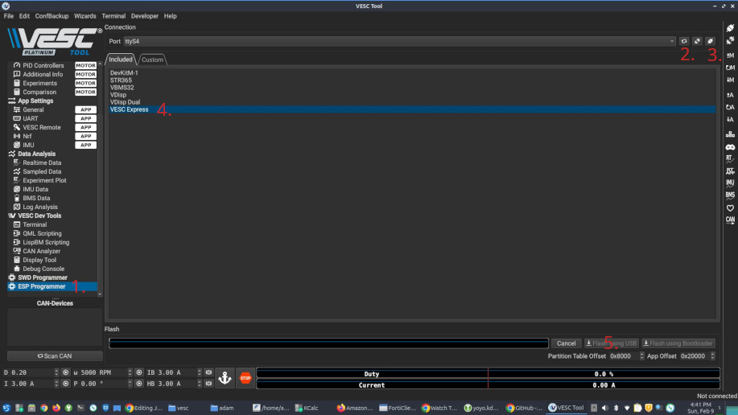

# JBD_BMS_BLE_VESC_EXPRESS_BRIDGE
An ESP32 firmware and companion LispBM script to connect multiple simultaneous JBD ble BMSes to VESC-EXPRESS via ESPNOW

## Features

- Connect to one or more JBD bms simultaneously and transmit cell data to vesc-express.
- For example, you could have three 14s bms connected to a single 42s battery pack, and see all 42 cells in vesc-tool.

## Required hardware

* Single or multiple "smart" JBD bms, with built in BT, or BT dongle.
	* Tested: model SP14S004, SP17S005, working.

* An ESP32 with BluetoothLE, this is the ESP-BRIDGE that connects to the single or multiple JBD bms over BT, and relays to VESC-EXPRESS, via esp-now.
	* Tested: ESP32-C3, ESP32-S3, working.

* A VESC-EXPRESS, this is an ESP32-C3 with a can-bus tranceiver, running the vesc-express firmware.

## How To
* Arduino environment:
   * An installation of the Arduino IDE.
   * The 'NimBLE-Arduino' bluetooth library installed in the Arduino IDE.
   * 'esp32 by Espressif Systems' installed in Arduino boards manager.
   * Open the JBD_BMS_BLE_VESC_EXPRESS_BRIDGE.ino file, configure user config as desired, compile and upload to ESP-BRIDGE
   * If you have any live JBD bms in range, open the Arduino serial monitor, you should see connection messages and cellnum:voltage scrolling.

* PlatformIO:
   * TBD

* Make:
   * TBD
 
* VESC-Tool: (6.02 or greater)
   * If you are starting with an un-flashed vesc-express(esp32-c3), open VESC-Tool, connect the esp32 via usb,
     1. Navigate to 'ESP Programmer'.
     2. Refresh the port.
     3. Connect.
     4. Select 'VESC Express'.
     5. Press 'Flash using USB'.
     
   *  Navigate to 'LispBM Scripting', upload the Lisp script, you should see esp-now cellnum:voltage data from the ESP-BRIDGE in the Console/REPL.

## TODO
- [ ] Write a better readme. (Ongoing...)
- :white_check_mark: Softcode the battery cell number, i.e. tally the total cell count on the esp32 bridge, and send over esp-now to lisp on vesc-express.
- :white_check_mark: Add support for 6.02 and 6.05. See: https://github.com/A-damW/JBD_BMS_BLE_VESC_EXPRESS_BRIDGE/issues/6
- :white_check_mark: Add CHANGELOG.md See: https://github.com/A-damW/JBD_BMS_BLE_VESC_EXPRESS_BRIDGE/blob/main/CHANGELOG.md
- [ ] Add support for cell/bms temperatures.
- [ ] Add support for charge/discharge control.
- [ ] Add How-to section.
- [ ] Add support for additional compilation environments: VScode, PlatformIO, Make, etc.
